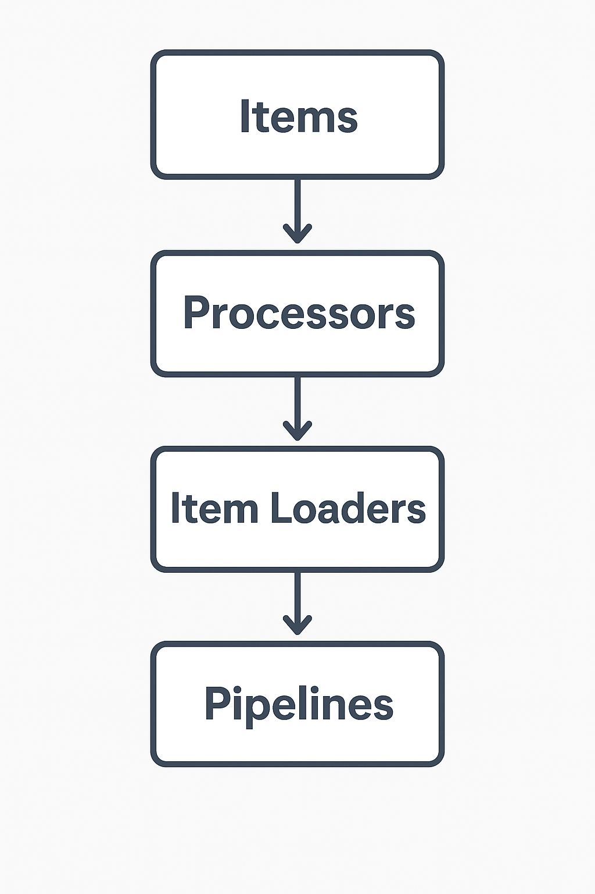

# Scrapy Items: Structuring and Processing Your Data

When working with Scrapy, it’s not enough to just scrape data—you also need a structured way to **store, clean, and process** it. This is where **Scrapy Items** come into play. Items act like containers for your scraped data, ensuring consistency, readability, and scalability in your scraping projects.

---

## 1. What are Scrapy Items?

Scrapy Items are **Python classes** that define the structure of the data you want to scrape. Think of them as lightweight containers similar to Python dictionaries but with additional support for **data validation and processing** .

📌 Example:

```python
import scrapy

class BookItem(scrapy.Item):
    title = scrapy.Field()
    price = scrapy.Field()
    rating = scrapy.Field()
```

Here, we’ve defined a `BookItem` with three fields: `title`, `price`, and `rating`. Each field is a `scrapy.Field()` object.

---

## 2. Why Use Items Instead of Dictionaries?

- ✅ Enforces **data consistency**
- ✅ Easy to add **input/output processors**
- ✅ Works seamlessly with **Item Loaders**
- ✅ Makes your code more **readable and maintainable**

---

## 3. Defining Input and Output Processors

When scraping, the raw data you extract may not always be clean. Input and output processors help you **transform data automatically** while loading it into an Item.

Scrapy provides a module called **`itemloaders.processors`** , where commonly used processors include:

- `TakeFirst()` → Takes the first non-null value
- `MapCompose()` → Applies one or more functions to each value
- `Join()` → Joins a list into a single string

📌 Example:

```python
from scrapy import Item, Field
from itemloaders.processors import TakeFirst, MapCompose, Join

def strip_text(value):
    return value.strip()

class BookItem(Item):
    title = Field(
        input_processor=MapCompose(strip_text),
        output_processor=TakeFirst()
    )
    price = Field(
        input_processor=MapCompose(str.strip),
        output_processor=TakeFirst()
    )
    tags = Field(
        output_processor=Join(", ")
    )
```

Here:

- `title` will be stripped of whitespace and only the first valid value will be stored.
- `tags` will be combined into a comma-separated string.

---

## 4. Using Items in Spiders

Instead of returning raw dictionaries from your spider, you return structured `Item` objects.

📌 Example:

```python
import scrapy
from myproject.items import BookItem

class BookSpider(scrapy.Spider):
    name = "books"
    start_urls = ["http://books.toscrape.com/"]

    def parse(self, response):
        for book in response.css("article.product_pod"):
            item = BookItem()
            item["title"] = book.css("h3 a::attr(title)").get()
            item["price"] = book.css(".price_color::text").get()
            item["rating"] = book.css("p.star-rating::attr(class)").get().split()[-1]
            yield item
```

---

## 5. Item Loaders: A Cleaner Way to Populate Items

Instead of assigning values manually, **Item Loaders** provide a clean and consistent way to populate Items, especially when you need to use input/output processors.

📌 Example:

```python
from scrapy.loader import ItemLoader
from myproject.items import BookItem

def parse(self, response):
    for book in response.css("article.product_pod"):
        loader = ItemLoader(item=BookItem(), selector=book)
        loader.add_css("title", "h3 a::attr(title)")
        loader.add_css("price", ".price_color::text")
        loader.add_xpath("rating", "./p[contains(@class, 'star-rating')]/@class")
        yield loader.load_item()
```

Here, Scrapy automatically applies processors while loading the item.

---

## 6. Items, Processors & Loaders: Putting It All Together

- **Items** define the structure of your scraped data.
- **Processors** clean and format raw data as it’s loaded.
- **Item Loaders** simplify the process of populating items using CSS/XPath selectors.

Together, they provide a powerful system to scrape **structured, clean, and production-ready datasets** .

---

## 7. Best Practices for Using Scrapy Items

- Define **all fields** you expect upfront.
- Use **input processors** to clean messy data (e.g., stripping whitespace, converting to numbers).
- Use **output processors** to unify formats (e.g., always return a single string or number).
- Prefer **Item Loaders** over manually setting fields in complex projects.
- Keep Items **modular** so they can be reused across spiders.

---

### ✅ Final Thoughts

Scrapy Items are not just about holding data—they ensure your scraping pipeline is **organized, scalable, and clean** . With Items, Processors, and Item Loaders, you can focus more on extracting useful information rather than worrying about raw HTML inconsistencies.

---


